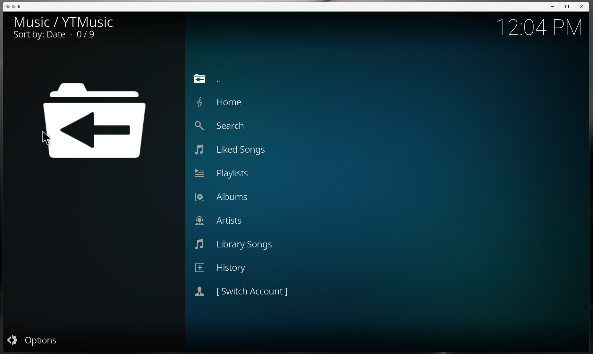
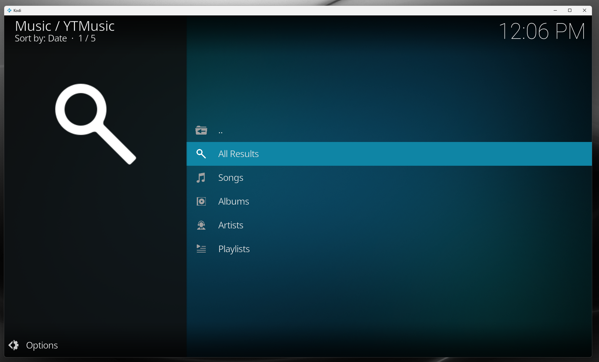
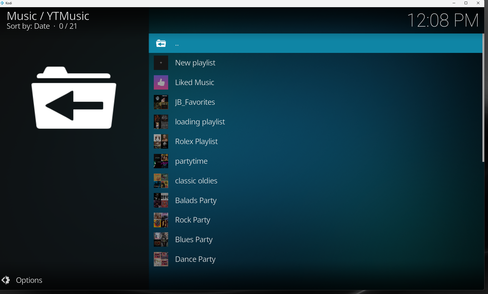
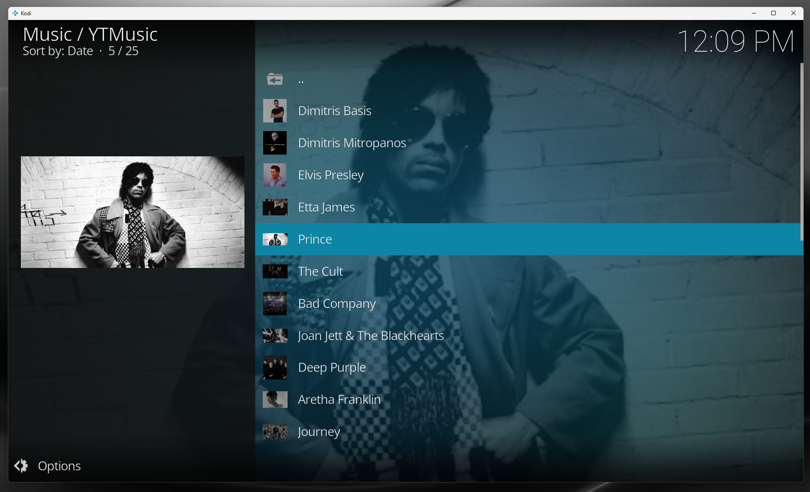
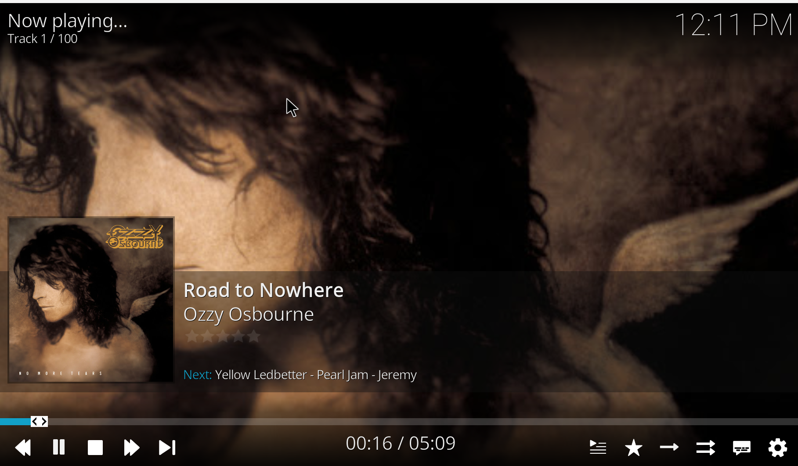
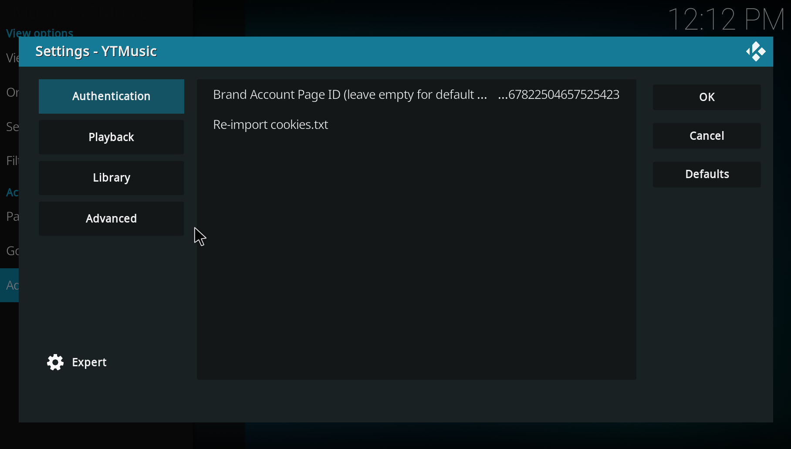

# YouTube Music for Kodi

**Unofficial YouTube Music add-on for Kodi.**

YouTube Music for Kodi is an unofficial Kodi add-on that lets you browse and play your YouTube Music Premium library directly inside Kodi. It is also known as a YouTube Music Kodi add-on, YT Music Kodi plugin, or `plugin.audio.ytmusic`.

---

## Screenshots

| | | |
|---|---|---|
|  |  |  |
| Home screen | Search | Playlists |
|  |  |  |
| Albums & artists | Now playing | Settings & authentication |

---

## Features

- Browse your YouTube Music library
- Search songs, albums, artists and playlists
- Play liked songs
- Play playlists
- Browse albums and artists
- Lyrics support
- Radio / watch-playlist support
- Audio quality selection (up to 256 kbps with Premium)
- Brand-account support
- Works on Kodi 21 Omega — Windows, LibreELEC and other supported platforms

## Installation

1. Download the latest **`plugin.audio.ytmusic-x.y.z.zip`** from the [Releases page](https://github.com/ypoulis-hub/kodi-youtube-music/releases/latest).
2. In Kodi, open **Settings → Add-ons**.
3. Choose **Install from zip file**.
4. Select the downloaded ZIP.
5. Open the add-on once it appears under **Music add-ons**.
6. Configure authentication (see below).

> _Recommended path (coming soon): install the YPoulis Kodi Repository add-on once and receive automatic updates for both this add-on and MotoGP VideoPass._

## Requirements

- Kodi 21 (Omega) or later
- An active **YouTube Music Premium** subscription
- Python 3 available on the host (Windows, LibreELEC, Linux, macOS)

## Authentication / Login

The add-on uses YouTube Music browser cookies to authenticate against your Google / YouTube Music Premium account.

1. Sign in to [music.youtube.com](https://music.youtube.com/) in a desktop browser.
2. Export the cookies for `music.youtube.com` using any `cookies.txt` extension (e.g. **Get cookies.txt LOCALLY**, **EditThisCookie**).
3. Place the file at the path the add-on reports on first run (typically `special://profile/cookies.txt`, which resolves to the add-on's user-data directory).
4. Restart the add-on. Brand accounts are picked up automatically once cookies are valid.

## Supported Kodi versions

- **Kodi 21 Omega** — primary target, regularly tested
- Kodi 20 Nexus may work but is not officially supported

## Supported platforms

- Windows 10 / 11
- LibreELEC (tested on x86_64 Generic builds)
- Other Linux desktops running Kodi
- macOS (untested but should work)

## Known limitations

- Some podcast / non-music YouTube Music content is not available
- Brand accounts must be visible to the cookies you provide
- Resume playback across sessions is not yet implemented (see [ROADMAP](ROADMAP.md))

## FAQ

**Is this an official YouTube Music add-on?**
No. This is an unofficial Kodi add-on. It is not affiliated with Google, YouTube or YouTube Music.

**Do I need YouTube Music Premium?**
Yes — premium quality (256 kbps) and ad-free playback require an active YouTube Music Premium subscription.

**Does it work with Kodi 21 Omega?**
Yes — Kodi 21 Omega is the primary target.

**Does it work on LibreELEC?**
Yes — it is regularly tested on LibreELEC running Kodi 21.

**How do I authenticate?**
Export your YouTube Music browser cookies into a `cookies.txt` file and point the add-on at it. See the Authentication section above.

**Why do I need cookies?**
YouTube Music does not expose a public auth API for third-party clients. Cookies tied to your account are the only way to verify your subscription and access your library.

## Troubleshooting

| Problem | Likely cause / fix |
|---|---|
| Login / authentication failed | Cookies missing, wrong path or for the wrong account. Re-export `cookies.txt` from a logged-in browser session. |
| Cookies expired | Re-export and replace `cookies.txt` — Google rotates auth tokens periodically. |
| Playback does not start | Check `kodi.log`. System Python with `yt-dlp` is used for stream resolution on Windows; make sure it is installed. |
| Search returns no results | Verify the cookies file is for the correct YouTube Music account. Brand accounts may need profile-switching before exporting. |
| Lyrics not loading | Lyrics depend on the track. If they are missing on YouTube Music itself, they will be missing here too. |
| Brand account not visible | Re-export cookies while signed in to the brand account, or switch profiles in YouTube Music settings before exporting. |

## Changelog

See [CHANGELOG.md](CHANGELOG.md).

## Roadmap

See [ROADMAP.md](ROADMAP.md).

## Support

- Open a [GitHub issue](https://github.com/ypoulis-hub/kodi-youtube-music/issues) using one of the templates (Bug, Feature request, Installation problem, Authentication problem).
- Use [GitHub Discussions](https://github.com/ypoulis-hub/kodi-youtube-music/discussions) for questions, feature ideas or general feedback.
- Follow the project on the [Kodi forum thread](https://forum.kodi.tv/showthread.php?tid=385237).

If you find this add-on useful, you can support development with a one-time donation:

## Disclaimer

This is an unofficial add-on and is **not** affiliated with, endorsed by or sponsored by Google, YouTube or YouTube Music. A valid **YouTube Music Premium** subscription is required for ad-free, full-quality playback.

## License

[MIT](LICENSE)
